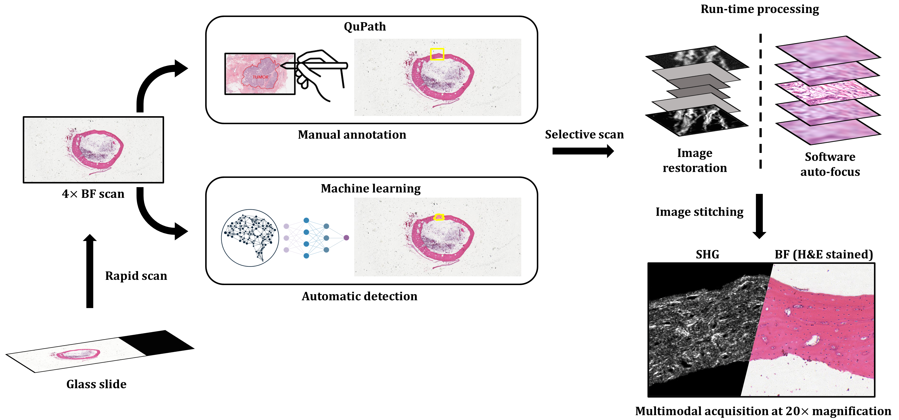

# SmartPath: an open-source automatic multimodal whole slidehistopathology imaging system

<div align="center">
  
</div>

SmartPath is an open-source multimodal whole slide histopathology imaging system with the capabilities of automaticmodality switching, region of interest detection, and run-time image processing, empowered by deep learning. The acquisition program is written in Jupyter Notebook and uses [Pycro-Manager](https://github.com/micro-manager/pycro-manager) for hardware control.  

## Installation
Install [anaconda/miniconda](https://docs.conda.io/en/latest/miniconda.html)  
Required packages  
```
  $ conda env create --name smartpath --file env.yml
  $ conda activate smartpath
  $ pip install pycromanager
```
## Software requirement
Micro-manager 2.0 gamma, OpenScan, and QuPath. See [document]("docs/manual.pdf") for details.  

## How to use  
See [document]("docs/manual.pdf") for details.  

## Related repositories
Supervised and weakly supervised classifier for histological datasets: https://github.com/uw-loci/histo-classifier.  
Run-time image enhancement for laser scanning microscopy with self-supervised denoising and single-image super-resolution: https://github.com/uw-loci/lsm-run-time-enhancement.
